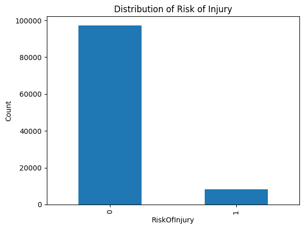
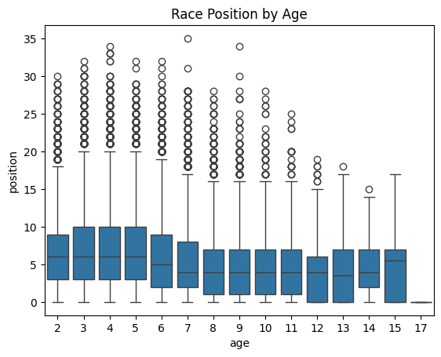
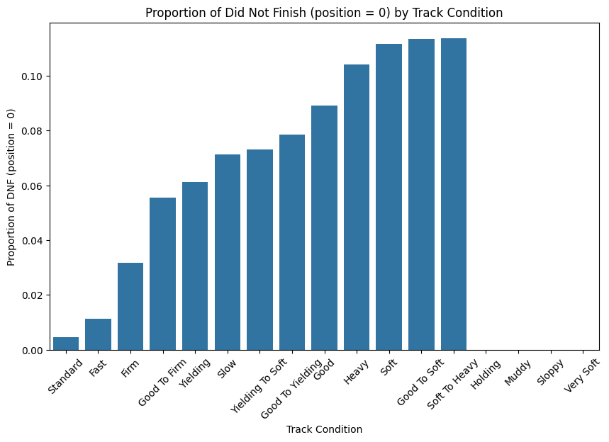
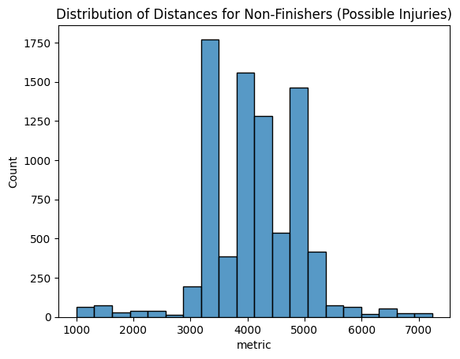
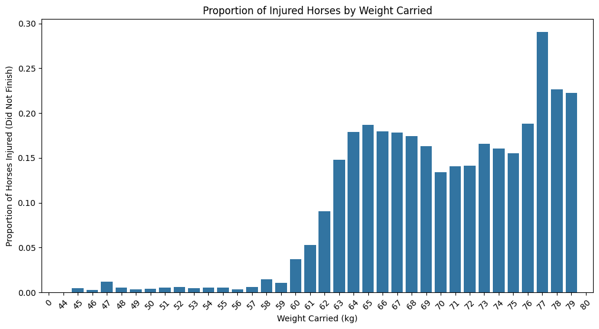
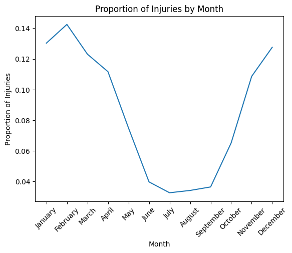
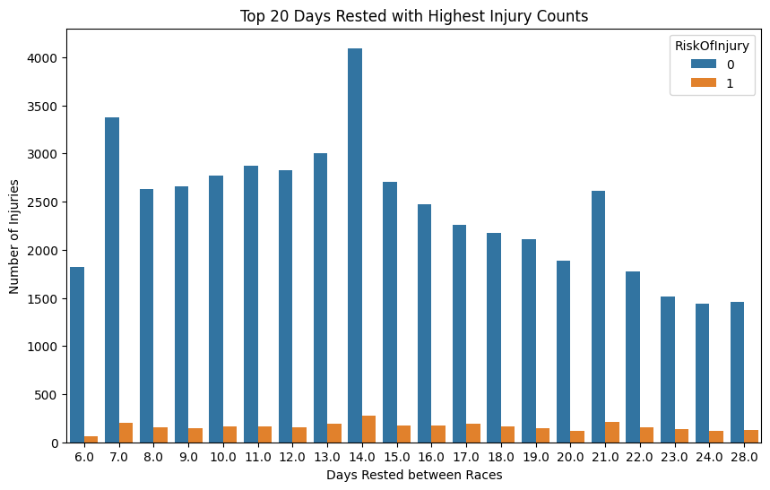
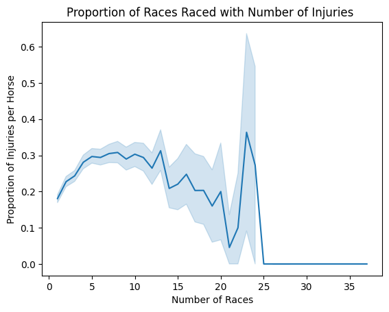

# Capstone Project: Predicting UK Racehorses' Risk of Injury Based on Historical Race and Biometric Data

Future Plans for Project:
- work with Ensemble Learning to raise accuracy and fix overfitting
- incorporate more csv's from other years to increase my dataset 

INTRODUCTION: 
This machine learning project hopes to predict UK racehorse injury and decline in peformice using biometric and historical race data. 

Problem Area:
Horse racing is an expensive and well-sought after sport to watch and participate in. Racehorses go through intense physical activity during their events which can quickly lead to performance decline and at times severe injury due to stress. By predicting injuries in these horses, we can ensure better health for them and in turn mitigate outrageous costs to their owners, and in contrast, even facilitate in their economics wins. 

Who is Affected:
- Horse Trainers can optimize training and race schedules
- Jockeys can have a better grasp of how their horse is going to be racing day of
- Owners can manage costs and maximize success of their horses
- Veterinarians can possibly use this as helpful insight when caring for the horses

Impact of the Project:
- Optimize training schedules
- Reduce injury frequency
- Financially helpful

Data Science Goal:
1. Create a model that can predict race position before incorporating biometric factors
2. Build a predictive model that can help identify injury rish based on performance trends.

Key Variables: 

Inputs : 
Age
Start Position (saddle)
Official Rating
Weight
Hurdles
Distance
Track Condition
Class
Fences
Days Rested
Races Ran
Day of the Year

Output : 
Risk of Injury (yes or no)

3 Main CSV's Used for This Project

1. BEFORE THE RACE PARAMS:
pre_racehorse_df:
contains information collected prior a race starts. The odds are averages from from Oddschecker.com, RPRc and TRc also have current values.

2. RACE PARAMS YEARLY:
race(year):
rid - Race id;
course - Course of the race, country code in brackets, AW means All Weather, no brackets means UK;
time - Time of the race in hh:mm format, London TZ;
date - Date of the race;
title - Title of the race;
rclass - Race class;
band - Band;
ages - Ages allowed
distance - Distance;
condition - Surface condition;
hurdles - Hurdles, their type and amount;
prizes - Places prizes;
winningTime - Best time shown;
prize - Prizes total (sum of prizes column);
metric - Distance in meters;
countryCode - Country of the race;
ncond - condition type (created from condition feature);
class - class type (created from rclass feature)

3. HORSE PARAMS YEARLY:
horse(year):
horses_* columns description:

rid - Race id;
horseName - Horse name;
age - Horse age;
saddle - Saddle # where horse starts;
decimalPrice - 1/Decimal price;
isFav - Was horse favorite before start? Can be more then one fav in a race;
trainerName - Trainer name;
jockeyName - Jockey name;
position - Finishing position, 40 if horse didn't finish;
positionL - how far a horse has finished from the pursued horse, horses corpses;
dist - how far a horse has finished from a winner, horses corpses;
weightSt - Horse weight in St;
weightLb - Horse weight in Lb;
overWeight - Overweight code;
outHandicap - Handicap;
headGear - Head gear code;
RPR - RP Rating;
TR - Topspeed;
OR - Official Rating
father - Horse's Father name;
mother - Horse's Mother name;
gfather - Horse's Grandfather name;
runners - Runners total;
margin - Sum of decimalPrices for the race;
weight - Horse weight in kg;
res_win - Horse won or not;
res_place - Horse placed or not

NOTES: 
Please be aware, the prices provided are the SP (starting prices), and they are not available before race starts. This means prices before start may differ from SP. But usually favorites stay the same, and prices on them often higher then SP. Anyway you can't predict profit with accuracy based only on SP prices.

The listed horse weight is based on the handicap system and decides the weight the horse needs too carry in order to make the race more even, its very common in UK/IRE horse racing. It is not a measurement of the actual horses weight.

### Demo
... Show your work:
...     Exploratory Data Analysis

We can see that our overall data is largely skewed, having nowhere near a balanced set of horses injured versus non injured. While we do our exploration this is fine; however important to note for modelling, as if we start to discover difficulty with model accuracy, performing SMOTE to balance the classes might benefit our final model.

Risk injury based off of age seems to be pretty evenely distributed with some outliers and the eldest age of 17 being the most frequent to encounter injuries, as expected.

Here we see that the most frequent occurences of injuries land on track conditions surrounding soft surfaces which reading into literature one can find that horses with sensitive tendons suffer more on soft surfaces. 

We can also see the injuries of horses lie mostly within races of around 3000 to 5000 meters.

With all of this information regarding 'handicap' and 'weight' we can come to some important inferences regarding our dataset. The handicap system works in the UK by assigning horses with the highest ratings to carry the heaviest weights as a way to "even out" the playing field. This weight includes the jockey, saddle, equipment, lead weights, etc. Here we see that injufies start to spike up after 76 kgs. We knoe that in traditional flat racing make handicap weight is 50 - 65 kg and in national hunt racing it lands around 60 - 75 kg. This means that these horses are most likley getting injured in amateur races where the handicap weight goes over 76 kgs.

This is very important because now we see that there is in fact more injuries per race during the winter months. Through literature, we discovered that this can be due to winter related risks such as Muscle Stiffness , Reduced Flexibility , Slippery due to Ice , Longer Warm-Ups , and Reduced Training.

We see there is a pattern of 7 day  , 14 day , 21 day, interval spikes for days rested.

There is a spike of injuries increasing around 20 through 25 races; therefore this seems to be a cap of when horses start to become weak. However, after 25 races there seems to be information on certain horses who were able to pass that cap and surprisingly raise no injuries while reaching up to 35 races in the year! This is an intersting subset of horses we can look deeper into.

...     Interactive demo (e.g., `streamlit` app)
...     Short video of users trying out the solution

### Methodology
... High-level diagrams of entire process:
...     1. Looked through and cleaned 2 CSV's (race and horse)
                horses_df cleaning:
                 drop unneccessary columns
                 normalize numerical values
                 fill missing values

                races_df cleaning:
                     drop unneccessary columns
                     normalize numerical values
                     convert categorical variables
        2. Merged both data frames
        3. Created small df of horse's name with Unique ID
        4. Exploratory Data Analysis
            Visualized Distributions of Injured and Non-Injured Data
            Correlations of My Features to Risk of Injury
            Visualizations of How Injury Risk is Related to:
                Age
                Track Conditions
                Distance of Race
                Weight Distributions
                Time Series
                Days Rested
                Number of Races
            Analyzed Subset of Horses Who Had No Injuries and High Race Count
...     5. Modelling directions:
            LogReg ( base , gridsearched )
            Random Forest (base , gridsearched , threshold tuned )
            XGBoost (base , gridsearched , threshold tuned )
...     6. Prototyping directions: working with Streamlit App to create a simulation of how the model works

#### Repository 

* `data` 
    - contains link to copy of the dataset (stored in a publicly accessible cloud storage)
    - saved copy of aggregated / processed data as long as those are not too large (> 10 MB)

* `model`
    - `joblib` dump of final model(s)

* `notebooks`
    - contains all final notebooks involved in the project

* `docs`
    - contains final report, presentations which summarize the project

* `references`
    - contains papers / tutorials used in the project

* `src`
    - Contains the project source code (refactored from the notebooks)

* `.gitignore`
    - Part of Git, includes files and folders to be ignored by Git version control

* `conda.yml`
    - Conda environment specification

* `README.md`
    - Project landing page (this page)

* `LICENSE`
    - Project license

#### Dataset

Pickled Model:

Kaggle Dataset: 
https://www.kaggle.com/datasets/hwaitt/horse-racing

### Credits & References

Thank you to BrainStation, Stephen, Borna, and Miranda for helping me and guiding me through this learning process for the past 12 weeks.
